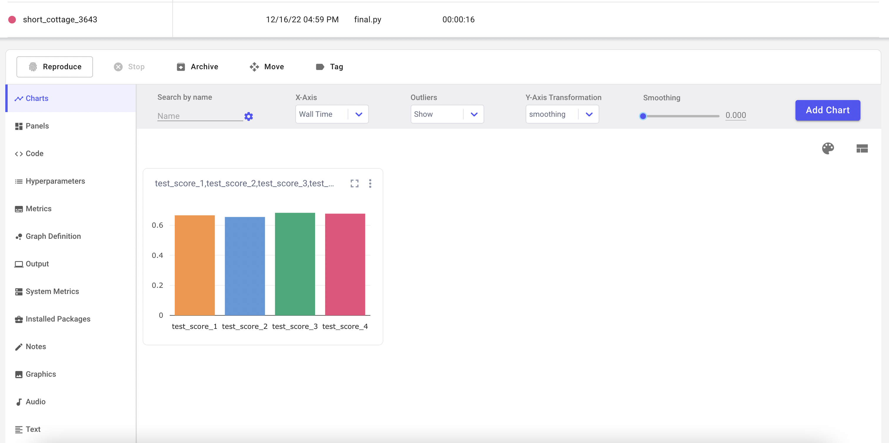

# README

```unix
.
├── data		Training data
├── models
│   ├── svm.pkl
│   └── vec.pkl
├── pages
│   └── 1_Restaurant_Information.py
├── source		Metaflow code of training				
│   ├── final.ipynb
│   ├── final.py
│   ├── generate_data.ipynb
│   └── train.py
├── Hello.py		Website file
├── README.md
└── requirements.txt
└── Final_Project.ipynb		Jupyternotebook containing all processes					

```

## Installation

```shell
git clone git@github.com:RchLi/MLSys-Final.git
cd MLSys-Final
pip install -r requirements.txt
```

## Jupyter Notebook

Final_Project.ipynb contains all the containing all the EDA, data preprocessing, model training, testing.

## Train Models

```shell
python source/train.py run
```

train.py is a metaflow file that pipelines the process of data processing and model training. It compares models' performance of different hyperparameters and stores the best one in models file.

The comet result is shown below



## Generate Websites

```shel
streamlit run Hello.py
```

## Deploy on AWS

We deploy our project on AWS EC-V2, to access the website, use the [url](http://44.202.255.243:8501/)

The deployment follow the same procesure as is shown above. We first create a new instance of EC-V2, connect to with ssh and install our project. Note that we train our models locally and only transfer the best model to the server to reduce the storage cost.
